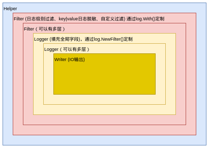
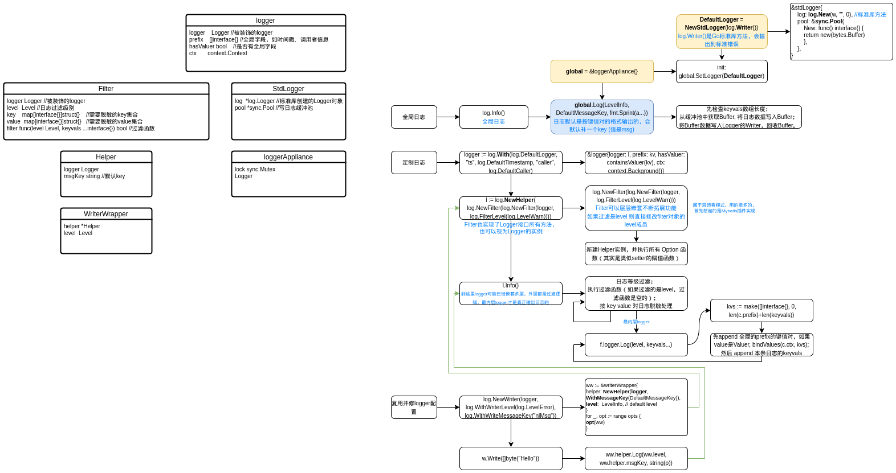

# gateway-02

+ **添加基础模块**

    + **日志**
    
      日志用的 kratos log 包下的实现。
    
    + **pprof**
    
    + **配置**
    
    + **监控**
    
+ **创建一个后端微服务**（暂时只支持HTTP协议），实现gateway转发

+ **添加服务注册&发现**

## 日志

代码封装的也比较简单，直接看图吧

流程图：

> 注意事项：
>
> 线上不要用 Fatal等级的方法，打印日志，因为会在打印日志后中断程序运行。